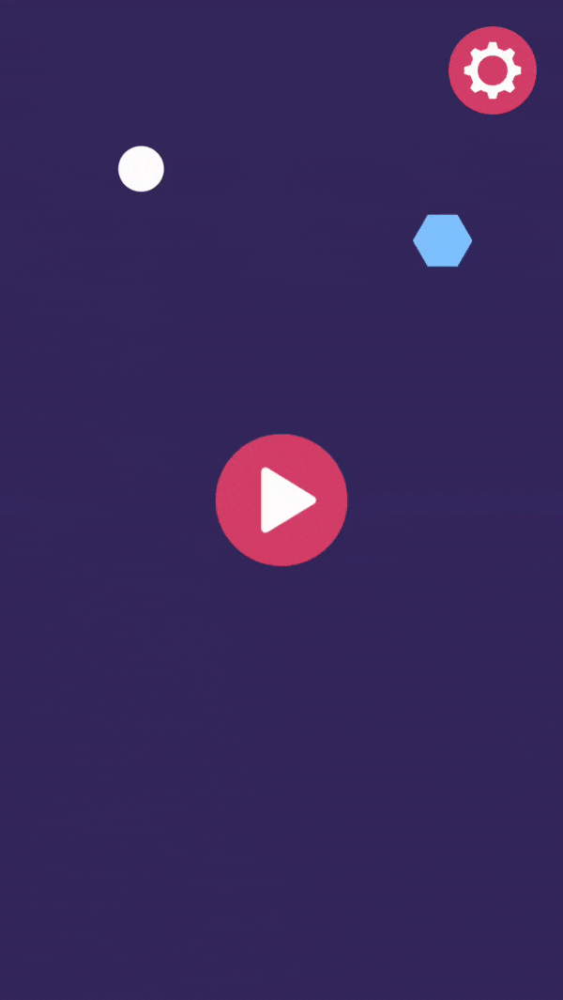

# ![alt text][logo] Heat Ball 2D
[logo]: https://github.com/atillaozder/heatball-ios/blob/master/src/Resources/Assets.xcassets/AppIcon.appiconset/Icon-29.png "Heat Ball 2D"

Heat Ball is a 2D game where players breaks the obstacles to clear the path of the ball. Remove all shapes by tapping on them and clear the path that the ball follows. The angle is key point! Be careful, if you miss any obstacle which ball will collide, the ball heats. Remember, overheated ball will eventually explode. How long you can survive and reach the highest score?

Game Features:
- Challenge your friends
- Simple and easy to play
- Dark mode support
- Great time killer

## License

MIT License

Copyright (c) 2020 Atilla Özder

Permission is hereby granted, free of charge, to any person obtaining a copy of this software and associated documentation files (the "Software"), to deal in the Software without restriction, including without limitation the rights to use, copy, modify, merge, publish, distribute, sublicense, and/or sell copies of the Software, and to permit persons to whom the Software is furnished to do so, subject to the following conditions:

The above copyright notice and this permission notice shall be included in all copies or substantial portions of the Software.

THE SOFTWARE IS PROVIDED "AS IS", WITHOUT WARRANTY OF ANY KIND, EXPRESS OR IMPLIED, INCLUDING BUT NOT LIMITED TO THE WARRANTIES OF MERCHANTABILITY, FITNESS FOR A PARTICULAR PURPOSE AND NONINFRINGEMENT. IN NO EVENT SHALL THE AUTHORS OR COPYRIGHT HOLDERS BE LIABLE FOR ANY CLAIM, DAMAGES OR OTHER LIABILITY, WHETHER IN AN ACTION OF CONTRACT, TORT OR OTHERWISE, ARISING FROM, OUT OF OR IN CONNECTION WITH THE SOFTWARE OR THE USE OR OTHER DEALINGS IN THE SOFTWARE.
